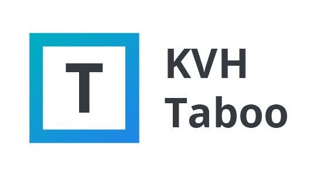

<p align="center"></p>

<p align="center"><b>A Taboo-based game for your browser</b></p>

<p align="center">


</p>

&nbsp;

> [!WARNING]
> Taboo is no longer actively maintained. Please feel free to [contact me](https://github.com/Kovah) if you are interested in this project.

&nbsp;

## Play now

The game is ready to play on [**taboo.kovah.de**](https://taboo.kovah.de/).

&nbsp;

## Installation

### Requirements

This game requires no PHP or other server-side langauge. It needs nothing more than a simple web
server that delivers HTML files and a modern browser.

### Installation from Download

Go to the [releases](https://github.com/Kovah/Taboo/releases) page and download the latest "taboo-build.zip"
package. Extract the files into your webserver directory and start your browser. Done.

### Installation from Source

Building the game from source requires [Node](https://nodejs.org/en/) installed on your machine.

Install all dependencies using yarn or NPM.
```
yarn install
OR
npm install
```

Compiles and hot-reloads for development
```
yarn run serve
OR
npm run serve
```

Compiles and minifies for production
```
yarn run build
OR
npm run build
```

&nbsp;

## Contributing

### Found a bug or typo? Have a feature request?

Please open a [new issue](https://github.com/Kovah/Taboo/issues/new) and explain what's wrong
or what needs to be improved.

### Game Mechanics

Please add an issue first where you explain what you want to change so we can discuss these changes.
Please do not rush forward and change the whole game without any feedback on your ideas to prevent
your pull request to be closed.

### Words

All words (or cards) are managed by the [taboo-data](https://www.npmjs.com/package/taboo-data) package.
Please visit the [git repo of the package](https://github.com/Kovah/Taboo-Data) for more information
about contributing.


---

KVH Tabu is a project by [Kevin Woblick](https://kovah.de) and [Contributors](https://github.com/Kovah/Tabu/graphs/contributors)
